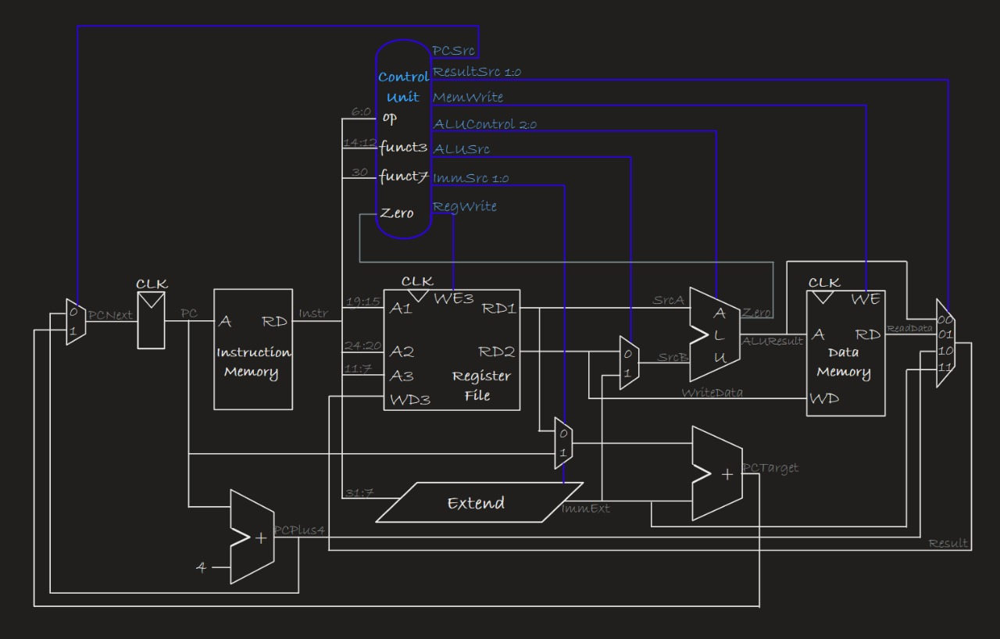

# RISC-V RV32I Microarchitecture (Verilog)


**Project Goal:**
- Implement a functional RV32I RISC-V CPU in Verilog, validate it with simulation, and then synthesize and implement it on an FPGA (Vivado). Start with a single-cycle (monocycle) implementation; once stable, evolve the design into a pipelined version and extend instruction coverage beyond I-type instructions.

---

## Monocycle Architecture



### What is a Monocycle CPU?
A **monocycle** (or single-cycle) CPU completes one instruction per clock cycle. In a single cycle, all stages of instruction execution happen at once:
1. **Instruction Fetch** — read instruction from memory using the program counter (PC)
2. **Decode** — control unit interprets the instruction bits and generates control signals
3. **Execute** — ALU performs the computation (addition, bitwise operations, shifts, etc.)
4. **Memory Access** — read from or write to data memory (if applicable)
5. **Writeback** — store the result into the register file

### Advantages of Monocycle Design
- **Simplicity** — each instruction progresses through all stages in a single clock period; minimal state management required.
- **Easy to understand and debug** — a straightforward path from fetch through execution to result storage.
- **Predictable timing** — no pipeline hazards or forwarding logic needed; each instruction completes before the next one starts.

### Disadvantages & Why We Pipeline Later
- **Slow clock** — the clock period must accommodate the *longest* path (often the data memory access or complex ALU operation), slowing down all instructions.
- **Low throughput** — only one instruction completes per cycle; a 5-stage pipeline would ideally finish 5× as many instructions in the same time.
- **Wasteful** — simple instructions like addition wait the same time as complex ones; hardware often sits idle.

### This Implementation (RV32I Monocycle)
Our design includes:
- **Register File** (`regfile.v`) — 32 × 32-bit registers for operands and results; uses combinational bypass + registered outputs for stable writes.
- **Instruction Memory** (`Instruction_memory.v`) — fetches 32-bit instructions from four byte-wide RAM modules, initialized with `.mem` files.
- **Data Memory** (`Data_memory.v`) — stores and retrieves data values during execution.
- **ALU + Shifter** — performs arithmetic, logic, and shift operations on operands.
- **Control Unit** (`Control_Unit.v` & `Main_decoder.v`) — decodes the instruction and routes signals to data and memory paths.
- **Immediate Extender** (`ImmExt.v`) — unpacks immediate values from compressed instruction encoding.
- **Top-Level CPU** (`RV32_loader.v`) — orchestrates all blocks and implements a registered writeback stage to avoid intra-cycle race conditions.

To keep writes stable, our monocycle uses a simple **registered writeback**: the ALU result, register address, and write-enable are captured at the end of the Execute stage and written to the register file at the beginning of the next cycle (Writeback stage). This trades one extra cycle per instruction for deterministic, race-free behavior.

---

**What this repository covers:**
- RTL blocks in Verilog (register file, ALU, control unit, instruction and data memories, shifter, etc.).
- A byte-segmented instruction memory flow: the program is split into four `.mem` files (one byte per file) and loaded into 4 byte-wide memories to form 32-bit little-endian instruction words.
- Simulation testbenches to validate each block and full CPU behavior (`tb_instruction_memory.v`, `tb_RV32_run.v`).
- A helper script to split assembled 32-bit hex words into 4 little-endian byte `.mem` files.
- Notes and recommended steps for synthesis and implementation with Vivado, including BRAM initialization strategies.

**Repository Layout (important folders/files):**
- `constrs_1/` : board constraint files (XDC) for target FPGA boards
- `sim_1/` : simulation-only files and testbenches
  - `sim_1/new/` : expected location for `program_ram0.mem` .. `program_ram3.mem` and TBs
- `sources_1/` : Verilog RTL modules
  - `imports/Modules/` : core Verilog modules (e.g. `My_memory.v`, `Instruction_memory.v`, `regfile.v`, `RV32_loader.v`, `ALU_decoder.v`, ...)
- `utils_1/` : build/implementation helper files
- `tools/split_program.py` : Python helper to split 32-bit hex words into 4 `.mem` files (little-endian per byte)
- `images/logo/risc-v3-1.jpg` : project logo used in this README

**Quick Start — Requirements**
- Vivado (2020.x / 2021.x / 2022.x / 2024.x or later) for synthesis, implementation and `xsim` behavioral simulation.
- Python 3 for `tools/split_program.py`.
- A RISC-V toolchain or assembler able to produce 32-bit instruction hex words (e.g. `riscv64-unknown-elf-as` + `objcopy` or your preferred toolchain).

**Prepare instruction memory (.mem files)**
1. Assemble or build your program to produce a text file where each line contains a 32-bit hex word (e.g. `0x00c585b3`) or plain hex nibble pairs — see the assembler output your tool produces.
2. Use the provided splitter to generate four byte-wide `.mem` files (little-endian order):

PowerShell example:

```powershell
# from project root
python tools\split_program.py --input program_words.txt --outdir sim_1\new --prefix program_ram
# produces sim_1\new\program_ram0.mem .. program_ram3.mem